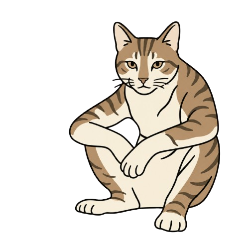
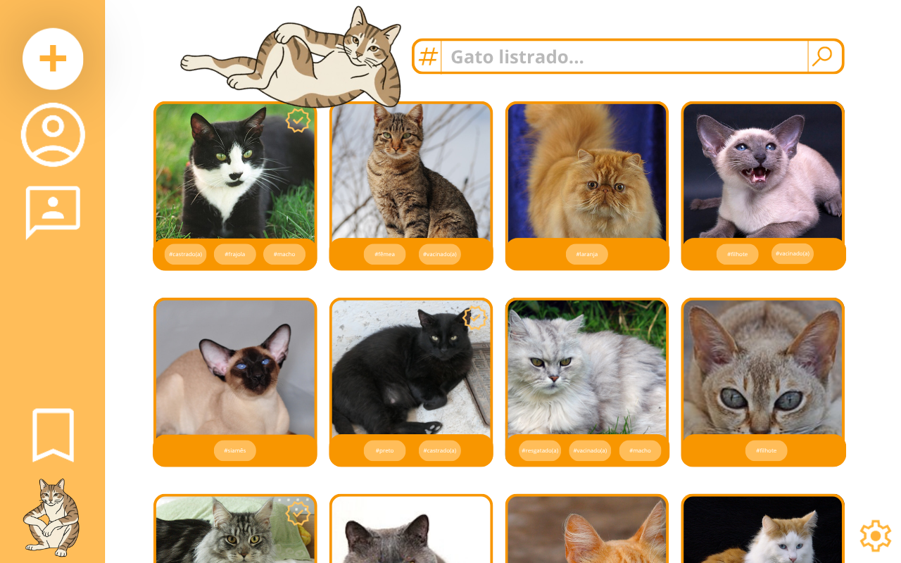
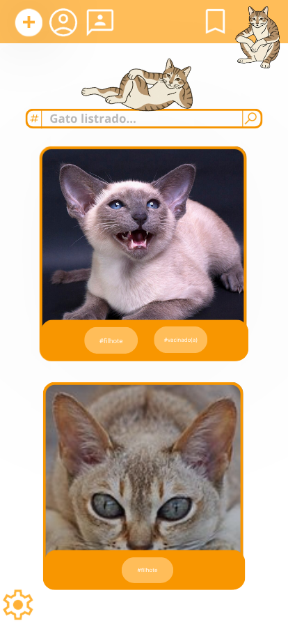

# Ronrom

## Conceito
O conceito inicial do projeto aborda um site e uma aplicação mobile destinada a adoção de gatos. A ideia inicial é que seja um site e um aplicativo totalmente otimizado e destinado a adoção de gatos, para além disso o site/app procura influenciar e fomentar a adoção de maneira correta seguindo conceitos que priorizam a segurança e a adaptação do gato. As duas aplicações seram totalmente otimizadas buscando e priorizando funcionalidades que virtualizem a adoção de forma responsável e segura.

## Estrutura conceitual do projeto
O projeto contara com tecnologias como HTML, CSS, Javascript e PowerApps. Apesar de manter o conceito, as duas aplicações serão um pouco diferente e seguiram uma estrutura com motivações adaptadas aos dispositivos utilizados para aplicação.

- Site: A aplicação web contara com tecnologias como HTML, CSS e Javascript. Além da aplicação web conter mais possiblidades ela conterá uma plataforma mais otimizada e focada no design, trazendo ao usuário uma sensação mais confortante e segura tanto para quem irá adotar o gato quanto para instituição ou pessoa que irá colocar o gato para a adoção.

- Aplicativo mobile: O aplicativo contara com a ferramenta PowerApps. O aplicativo por sua vez não terá um foco tão grande em design mais sim em adaptação, o design será sim um pilar para o projeto web mais o importante será a adaptação da aplicação web a aplicação mobile, isso será importante para conservar as funcionalidades do projeto web assim potencializando a versão web.

Apesar da diferença de foco a intenção será manter as duas plataformas igualmente funcionais seguindo os conceitos iniciais.

##  Funcionalidades do sistema
Os sistemas vão conter diversas funcionalidades durante sua criação. O projeto irá ser aberto a novas funcionalidades durante o processo de criação, porém as funcionalidades esperadas inicialmente são.

- Possibilidade de adotar e colocar para a adoção.
- Possibilidade de filtrar pesquisas com base em necessidades, características e possibilidades em questão tanto a gatos quanto a possibilidade de cuidado.
- Possibilidade de criação de organizações legais.
- Possibilidade de denuncia a maos tratos tanto de quem vai adotar quanto da organização ou pessoa que coloca para a adoção.

## Características visuais
As características visuais serão feitas através da ferramenta Canva. Apesar de ter a motivação de ser feito utilizando Canva, isso não limitara a possibilidade de aplicações diferentes. A paleta de cores será focada no laranja e branco, a estetica será comica com intuito de ser diferente do convencional, fugindo um pouco da estetica profissional, as limitações ajudam o projeto a ser um objeto de estudo.

#### Logo: 
 

#### Protótipo de tela Web: 
 

#### Protótipo de tela Mobile: 
 